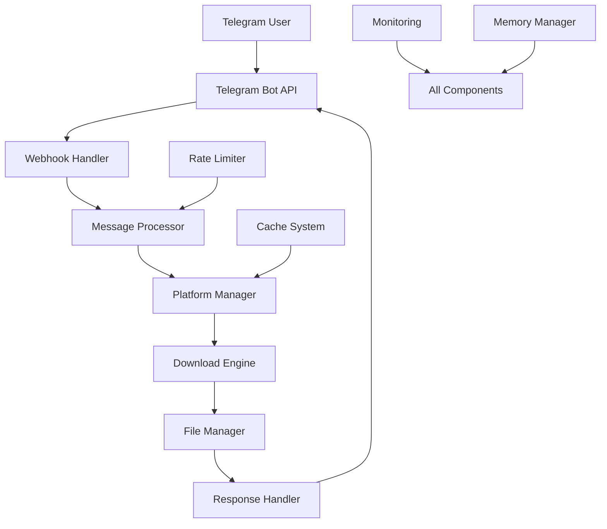

# 🎬 Telegram Video Downloader Bot

<div align="center">


**A modern, interactive Telegram bot for downloading videos from multiple social media platforms with advanced architecture and enhanced user experience.**

[🚀 Quick Start](#-quick-start) • [📖 Documentation](#-documentation) • [🔧 Installation](#-installation) • [🌐 Supported Platforms](#-supported-platforms) • [⚙️ Configuration](#️-configuration)

</div>

---

## 📋 Table of Contents

- [🎯 Overview](#-overview)
- [✨ Key Features](#-key-features)
- [🌐 Supported Platforms](#-supported-platforms)
- [🚀 Quick Start](#-quick-start)
- [🔧 Installation](#-installation)
- [⚙️ Configuration](#️-configuration)
- [🎮 Bot Commands](#-bot-commands)
- [📱 Usage Examples](#-usage-examples)
- [🏗️ Architecture](#️-architecture)
- [🔒 Security Features](#-security-features)
- [📊 Monitoring & Analytics](#-monitoring--analytics)
- [🧪 Testing](#-testing)
- [🚀 Deployment](#-deployment)
- [🛠️ Development](#️-development)
- [📚 API Reference](#-api-reference)
- [❓ FAQ](#-faq)
- [🤝 Contributing](#-contributing)
- [📄 License](#-license)

---

## 🎯 Overview

Telegram Video Downloader Bot v3.0.0 is a sophisticated, production-ready bot that enables users to download videos from multiple social media platforms directly through Telegram. Built with modern Python async/await patterns and featuring a modular architecture, it provides reliable, fast, and secure video downloading capabilities.

### 🎪 Demo

```
🎬 Bot Telegram pentru Descărcare Video

Bun venit! Sunt aici să te ajut să descarci videoclipuri de pe diverse platforme.

🔗 Platforme suportate:
• TikTok  
• Instagram
• Facebook
• Twitter/X
• Threads
• Pinterest
• Reddit
• Vimeo
• Dailymotion

⚠️ Limitări:
- Videoclipuri max 3 ore
- Mărime max 45MB
- Calitate max 720p
- Doar videoclipuri publice
```

---

## ✨ Key Features

### 🎯 User Interface
- **🎯 Interactive Menu** with inline buttons
- **📥 Automatic Download** of video content
- **✅ Download Confirmation** with preview links
- **🔄 Post-Download Options** (new download, menu)
- **❓ Integrated FAQ** section
- **🌍 Multi-language Support** (Romanian/English)

### 🏗️ Advanced Architecture
- **🔧 Modular Architecture** with separation of concerns
- **🔄 Retry Logic** with exponential backoff
- **⚡ Rate Limiting** for spam protection
- **💾 Memory Management** optimized for Free Tier hosting
- **📊 Monitoring System** with real-time metrics
- **🧪 Complete Testing Framework** with pytest
- **🔗 Platform Manager** for handling multiple platforms

### 🛡️ Security & Reliability
- **🔒 Environment Variables** for sensitive data
- **🛡️ Anti-Detection Mechanisms** with user agent rotation
- **🚦 Rate Limiting** per platform and user
- **🔄 Automatic Failover** between download methods
- **📝 Comprehensive Logging** for debugging
- **🧹 Automatic Cleanup** of temporary files

### ⚡ Performance
- **🚀 Async/Await** architecture for high concurrency
- **💾 Intelligent Caching** with TTL and memory management
- **🔄 Connection Pooling** for efficient resource usage
- **📊 Real-time Monitoring** with health checks
- **🎯 Optimized for Free Tier** hosting platforms

---

## 🌐 Supported Platforms

| Platform | Domains | Features | Status |
|----------|---------|----------|--------|
| **📱 TikTok** | `tiktok.com`, `vm.tiktok.com` | Public videos, watermark removal | ✅ Active |
| **📸 Instagram** | `instagram.com` | Posts, Reels, IGTV, Stories | ✅ Active |
| **📘 Facebook** | `facebook.com`, `fb.watch`, `fb.me` | Public videos, URL normalization | ✅ Active |
| **🐦 Twitter/X** | `twitter.com`, `x.com` | Public video tweets | ✅ Active |
| **🧵 Threads** | `threads.net` | Public video posts | ✅ Active |
| **📌 Pinterest** | `pinterest.com`, `pin.it` | Video pins | ✅ Active |
| **🔴 Reddit** | `reddit.com`, `redd.it`, `v.redd.it` | Public videos | ✅ Active |
| **🎬 Vimeo** | `vimeo.com`, `player.vimeo.com` | Public and premium videos | ✅ Active |
| **📺 Dailymotion** | `dailymotion.com`, `dai.ly` | Public videos | ✅ Active |
| **🔴 YouTube** | `youtube.com`, `youtu.be` | - | ❌ Not Supported |

### 📋 Platform-Specific Features

#### 📱 TikTok
- ✅ Watermark removal
- ✅ High-quality downloads
- ✅ Short URL support (`vm.tiktok.com`)
- ✅ Anti-detection mechanisms

#### 📸 Instagram
- ✅ Posts, Reels, IGTV
- ✅ Story downloads (public)
- ✅ Multiple format support
- ✅ User agent rotation

#### 📘 Facebook
- ✅ Advanced URL normalization
- ✅ Multiple fallback methods
- ✅ Share link support (`facebook.com/share/v/`)
- ✅ Reel format conversion

#### 🐦 Twitter/X
- ✅ Video tweets
- ✅ GIF support
- ✅ Multiple quality options
- ✅ Thread video support

---

## 🚀 Quick Start

### 1️⃣ Prerequisites

```bash
# Python 3.8 or higher
python --version

# Git (for cloning)
git --version
```

### 2️⃣ Clone Repository

```bash
git clone https://github.com/matrix01mindset/Downloader-Bot-Telegram.git
cd Downloader-Bot-Telegram
```

### 3️⃣ Install Dependencies

```bash
# Create virtual environment
python -m venv .venv

# Activate virtual environment
# Windows
.venv\Scripts\activate
# Linux/Mac
source .venv/bin/activate

# Install dependencies
pip install -r requirements.txt
```

### 4️⃣ Configure Environment

```bash
# Copy environment template
cp .env.example .env

# Edit .env file with your bot token
# TELEGRAM_BOT_TOKEN=your_bot_token_here
```

### 5️⃣ Run Bot

```bash
# Local development
python bot.py

# Production with app.py
python app.py
```

---

## 🔧 Installation

### 📦 Dependencies

The bot requires the following main dependencies:

```txt
yt-dlp[default]>=2023.12.30    # Video downloading engine
telegram-bot-api>=7.0.0        # Telegram Bot API wrapper
requests>=2.31.0               # HTTP requests
aiohttp>=3.9.0                 # Async HTTP client
psutil>=5.9.0                  # System monitoring
pytest>=7.4.0                  # Testing framework
```

### 🐳 Docker Installation

```dockerfile
# Use official Python runtime
FROM python:3.11-slim

# Set working directory
WORKDIR /app

# Copy requirements and install dependencies
COPY requirements.txt .
RUN pip install --no-cache-dir -r requirements.txt

# Copy application code
COPY . .

# Expose port
EXPOSE 10000

# Run application
CMD ["python", "app.py"]
```

```bash
# Build and run with Docker
docker build -t telegram-video-bot .
docker run -p 10000:10000 --env-file .env telegram-video-bot
```

### 🌐 Platform-Specific Installation

#### Render.com
```yaml
# render.yaml
services:
  - type: web
    name: telegram-video-bot
    env: python
    buildCommand: pip install -r requirements.txt
    startCommand: python app.py
    envVars:
      - key: TELEGRAM_BOT_TOKEN
        sync: false
```

#### Heroku
```bash
# Install Heroku CLI and deploy
heroku create your-bot-name
heroku config:set TELEGRAM_BOT_TOKEN=your_token
git push heroku main
```

#### Railway
```bash
# Install Railway CLI and deploy
railway login
railway new
railway add
railway deploy
```

---

## ⚙️ Configuration

### 🔐 Environment Variables

| Variable | Description | Required | Default |
|----------|-------------|----------|----------|
| `TELEGRAM_BOT_TOKEN` | Bot token from @BotFather | ✅ Yes | - |
| `WEBHOOK_URL` | Webhook URL for production | 🔶 Production | - |
| `PORT` | Server port | ❌ No | `10000` |
| `DEBUG` | Enable debug mode | ❌ No | `False` |
| `MAX_DOWNLOAD_SIZE` | Max file size (MB) | ❌ No | `45` |
| `RATE_LIMIT_REQUESTS` | Requests per minute | ❌ No | `10` |
| `CACHE_TTL` | Cache TTL in seconds | ❌ No | `3600` |

### 📁 Configuration Files

#### `.env.example`
```env
# Telegram Bot Configuration
TELEGRAM_BOT_TOKEN=your_bot_token_here
WEBHOOK_URL=https://your-domain.com/webhook

# Application Settings
PORT=10000
DEBUG=False
MAX_DOWNLOAD_SIZE=45

# Rate Limiting
RATE_LIMIT_REQUESTS=10
RATE_LIMIT_WINDOW=60

# Cache Configuration
CACHE_TTL=3600
CACHE_MAX_SIZE=1000

# Monitoring
MONITORING_ENABLED=true
LOG_LEVEL=INFO
```

#### `config.yaml`
```yaml
platforms:
  tiktok:
    enabled: true
    priority: 1
    rate_limit_per_minute: 15
    max_file_size_mb: 45
    watermark_removal: true
    
  instagram:
    enabled: true  
    priority: 2
    rate_limit_per_minute: 20
    max_file_size_mb: 45
    user_agent_rotation: true
    
  facebook:
    enabled: true
    priority: 3
    rate_limit_per_minute: 10
    max_file_size_mb: 45
    url_normalization: true
```

---

## 🎮 Bot Commands

### 📋 Available Commands

| Command | Description | Usage | Access Level |
|---------|-------------|-------|-------------|
| `/start` | Start bot and show main menu | `/start` | 👤 All Users |
| `/help` | Show comprehensive help guide | `/help` | 👤 All Users |
| `/menu` | Return to main menu | `/menu` | 👤 All Users |
| `/ping` | Check bot status | `/ping` | 👤 All Users |
| `/stats` | Show system statistics | `/stats` | 👨‍💼 Admin Only |
| `/health` | System health check | `/health` | 👨‍💼 Admin Only |
| `/platforms` | List supported platforms | `/platforms` | 👤 All Users |
| `/settings` | User settings | `/settings` | 👤 All Users |

### 🎯 Interactive Menu Options

```
📖 Cum să folosesc botul     → Detailed usage guide
🔗 Platforme suportate       → Supported platforms list
⚙️ Setări și limitări        → Settings and limitations
❓ Întrebări frecvente        → Frequently asked questions
```

### 📱 Command Examples

#### Basic Usage
```
User: /start
Bot: 🎬 Bot Telegram pentru Descărcare Video
     [Interactive menu with buttons]

User: https://www.tiktok.com/@user/video/1234567890
Bot: 🔄 Procesez videoul...
     ✅ Video descărcat cu succes!
     [Video file sent]
```

#### Advanced Usage
```
User: /help
Bot: 🤖 Bot Descărcare Video - Ghid Complet
     [Comprehensive help with all features]

User: /stats
Bot: 📊 System Statistics:
     • Uptime: 2d 14h 32m
     • Downloads: 1,247
     • Success Rate: 94.2%
     • Memory Usage: 156MB
```

---

## 📱 Usage Examples

### 🎬 Video Download Process

#### 1️⃣ TikTok Download
```
User: https://www.tiktok.com/@username/video/7123456789

Bot: 🔄 Procesez videoul TikTok...
     📱 Platform: TikTok
     👤 Creator: @username
     ⏱️ Duration: 0:15
     📊 Size: 2.3MB
     
     ✅ Descărcare completă!
     [Sends video file]
     
     🔄 Descarcă alt video
     🏠 Meniu principal
```

#### 2️⃣ Instagram Reel
```
User: https://www.instagram.com/reel/ABC123DEF456/

Bot: 🔄 Procesez Reel-ul Instagram...
     📸 Platform: Instagram
     👤 Creator: @creator_name
     ⏱️ Duration: 0:30
     📊 Size: 4.7MB
     
     ✅ Descărcare completă!
     [Sends video file]
```

#### 3️⃣ Facebook Video
```
User: https://www.facebook.com/watch?v=1234567890

Bot: 🔄 Procesez videoul Facebook...
     📘 Platform: Facebook
     👤 Page: Example Page
     ⏱️ Duration: 2:15
     📊 Size: 12.8MB
     
     ✅ Descărcare completă!
     [Sends video file]
```

### ❌ Error Handling Examples

#### Private Content
```
User: https://www.instagram.com/p/private_post/

Bot: ❌ Instagram: Conținut privat sau necesită autentificare.
     
     💡 Pentru Instagram: Folosește --cookies-from-browser
     📖 Vezi: https://github.com/yt-dlp/yt-dlp/wiki/FAQ
```

#### File Too Large
```
User: https://www.facebook.com/watch?v=large_video

Bot: ❌ Fișierul este prea mare (67.3MB).
     
     📊 Dimensiune: 67.3MB
     ⚠️ Limita Telegram: 50MB (pentru bot-uri)
     
     💡 Încearcă un clip mai scurt sau o calitate mai mică.
```

#### Unsupported Platform
```
User: https://www.youtube.com/watch?v=abc123

Bot: ❌ YouTube nu este suportat momentan.
     Te rog să folosești alte platforme:
     Facebook, Instagram, TikTok, Twitter, etc.
```

---

## 🏗️ Architecture

### 📊 System Overview



### 🔧 Core Components

#### 1️⃣ Bot Manager (`core/bot_manager.py`)
```python
class BotManager:
    """Main bot lifecycle management"""
    
    async def initialize(self) -> bool:
        """Initialize bot with cold start optimization"""
        
    async def handle_message(self, update: Update) -> None:
        """Process incoming messages"""
        
    async def shutdown(self) -> None:
        """Graceful shutdown with cleanup"""
```

#### 2️⃣ Platform Manager (`core/platform_manager.py`)
```python
class PlatformManager:
    """Manages multiple video platforms"""
    
    async def detect_platform(self, url: str) -> str:
        """Detect platform from URL"""
        
    async def download_video(self, video_info: VideoInfo) -> str:
        """Download video using appropriate platform"""
        
    async def get_platform_status(self) -> Dict[str, bool]:
        """Get health status of all platforms"""
```

#### 3️⃣ Message Processor (`core/message_processor.py`)
```python
class MessageProcessor:
    """Processes and routes messages"""
    
    async def process_url(self, url: str, chat_id: int) -> ProcessResult:
        """Process video URL and initiate download"""
        
    async def process_command(self, command: str, args: List[str]) -> CommandResult:
        """Process bot commands"""
```

#### 4️⃣ Download Engine (`downloader.py`)
```python
def download_video(url: str, output_path: str = None) -> Dict[str, Any]:
    """Main download function with error handling"""
    
def is_supported_url(url: str) -> bool:
    """Check if URL is supported"""
    
def validate_url(url: str) -> Tuple[bool, str]:
    """Validate URL format and accessibility"""
```

### 🔄 Data Flow

1. **Message Reception**: Telegram sends update to webhook
2. **URL Detection**: Extract and validate video URLs
3. **Platform Detection**: Identify source platform
4. **Rate Limiting**: Check and apply rate limits
5. **Download Process**: Execute download with retries
6. **File Processing**: Validate and prepare file
7. **Response**: Send file back to user
8. **Cleanup**: Remove temporary files

### 💾 Memory Management

```python
class MemoryManager:
    """Optimized for Free Tier hosting"""
    
    def __init__(self, max_memory_mb: int = 512):
        self.max_memory = max_memory_mb * 1024 * 1024
        
    async def check_memory_usage(self) -> float:
        """Monitor current memory usage"""
        
    async def cleanup_if_needed(self) -> bool:
        """Cleanup when memory threshold reached"""
```

---

## 🔒 Security Features

### 🛡️ Security Measures

#### 1️⃣ Environment Security
- ✅ **Environment Variables**: All sensitive data in env vars
- ✅ **Token Protection**: Bot token never logged or exposed
- ✅ **Git Security**: `.gitignore` prevents secret commits
- ✅ **File Cleanup**: Automatic removal of temporary files

#### 2️⃣ Anti-Detection
```python
REAL_USER_AGENTS = [
    'Mozilla/5.0 (Windows NT 10.0; Win64; x64) AppleWebKit/537.36...',
    'Mozilla/5.0 (Macintosh; Intel Mac OS X 10_15_7) AppleWebKit/537.36...',
    # ... more user agents
]

def get_random_headers():
    """Generate randomized headers for requests"""
    return {
        'User-Agent': random.choice(REAL_USER_AGENTS),
        'Accept-Language': random.choice(ACCEPT_LANGUAGES),
        'Accept': 'text/html,application/xhtml+xml,application/xml;q=0.9,*/*;q=0.8',
        'Connection': 'keep-alive',
    }
```

#### 3️⃣ Rate Limiting
```python
class RateLimiter:
    """Per-platform and per-user rate limiting"""
    
    def __init__(self, max_requests: int = 10, time_window: int = 60):
        self.max_requests = max_requests
        self.time_window = time_window
        
    async def is_allowed(self, identifier: str) -> bool:
        """Check if request is allowed"""
```

#### 4️⃣ Input Validation
```python
def validate_url(url: str) -> Tuple[bool, str]:
    """Comprehensive URL validation"""
    
    # Check URL format
    if not url or not isinstance(url, str):
        return False, "URL invalid sau lipsă"
        
    # Check for malicious patterns
    malicious_patterns = ['javascript:', 'data:', 'file:', 'ftp:']
    if any(pattern in url.lower() for pattern in malicious_patterns):
        return False, "URL suspect detectat"
        
    # Validate domain
    if not is_supported_url(url):
        return False, "Platformă nesuportată"
        
    return True, "URL valid"
```

### 🔐 Security Best Practices

#### Environment Setup
```bash
# Never commit these files
echo ".env" >> .gitignore
echo "config.py" >> .gitignore
echo "secrets.json" >> .gitignore

# Use environment variables
export TELEGRAM_BOT_TOKEN="your_secure_token"
export WEBHOOK_URL="https://your-secure-domain.com/webhook"
```

#### Production Security
```python
# app.py - Production security headers
app.add_middleware(
    CORSMiddleware,
    allow_origins=["https://api.telegram.org"],
    allow_credentials=True,
    allow_methods=["POST"],
    allow_headers=["*"],
)

# Webhook validation
def verify_telegram_webhook(request):
    """Verify webhook authenticity"""
    token = os.getenv('TELEGRAM_BOT_TOKEN')
    secret_key = hashlib.sha256(token.encode()).digest()
    # ... verification logic
```

---

## 📊 Monitoring & Analytics

### 📈 Real-time Metrics

#### System Metrics
```python
class MonitoringSystem:
    """Comprehensive monitoring and analytics"""
    
    def __init__(self):
        self.metrics = {
            'downloads_total': 0,
            'downloads_successful': 0,
            'downloads_failed': 0,
            'platforms_usage': {},
            'error_types': {},
            'response_times': [],
            'memory_usage': [],
            'uptime_start': time.time()
        }
    
    def record_download(self, platform: str, success: bool, duration: float):
        """Record download metrics"""
        
    def get_statistics(self) -> Dict[str, Any]:
        """Get comprehensive statistics"""
```

#### Health Checks
```python
@app.get("/health")
async def health_check():
    """Comprehensive health check endpoint"""
    return {
        "status": "healthy",
        "timestamp": datetime.utcnow().isoformat(),
        "uptime": get_uptime(),
        "memory_usage": get_memory_usage(),
        "platform_status": await get_platform_status(),
        "recent_errors": get_recent_errors(limit=5)
    }
```

### 📊 Analytics Dashboard

#### Usage Statistics
```
📊 SYSTEM STATISTICS
════════════════════
🕐 Uptime: 2d 14h 32m
📥 Total Downloads: 1,247
✅ Success Rate: 94.2%
💾 Memory Usage: 156MB / 512MB
🔄 Active Downloads: 3

📱 PLATFORM USAGE
═════════════════
📱 TikTok: 45.2% (564 downloads)
📸 Instagram: 28.7% (358 downloads)
📘 Facebook: 15.1% (188 downloads)
🐦 Twitter: 8.3% (103 downloads)
🎬 Other: 2.7% (34 downloads)

⚠️ RECENT ERRORS
════════════════
• Rate limit exceeded (Instagram): 3 times
• File too large: 2 times
• Private content: 1 time
```

### 🔍 Logging System

```python
# Structured logging configuration
logging.basicConfig(
    level=logging.INFO,
    format='%(asctime)s - %(name)s - %(levelname)s - %(message)s',
    handlers=[
        logging.FileHandler('bot.log'),
        logging.StreamHandler()
    ]
)

# Platform-specific loggers
logger = logging.getLogger(__name__)
download_logger = logging.getLogger('downloader')
platform_logger = logging.getLogger('platforms')
```

---

## 🧪 Testing

### 🔬 Test Suite Overview

The bot includes a comprehensive testing framework with multiple test types:

```
tests/
├── conftest.py              # Test configuration and fixtures
├── test_platform_manager.py # Platform management tests
├── test_cache.py           # Cache system tests
├── test_monitoring.py      # Monitoring system tests
├── test_memory_manager.py  # Memory management tests
├── run_tests.py           # Test runner with reporting
└── README.md              # Testing documentation
```

### 🧪 Test Categories

#### 1️⃣ Unit Tests
```python
# test_platform_manager.py
class TestPlatformManager:
    """Test platform detection and management"""
    
    async def test_detect_platform_tiktok(self):
        """Test TikTok platform detection"""
        manager = PlatformManager()
        platform = await manager.detect_platform("https://www.tiktok.com/@user/video/123")
        assert platform == "tiktok"
    
    async def test_download_video_success(self):
        """Test successful video download"""
        # Mock download test
        pass
```

#### 2️⃣ Integration Tests
```python
# test_integration.py
class TestBotIntegration:
    """Test complete bot workflows"""
    
    async def test_full_download_workflow(self):
        """Test complete download process"""
        # Test URL -> Platform Detection -> Download -> Response
        pass
    
    async def test_error_handling_workflow(self):
        """Test error handling in complete workflow"""
        pass
```

#### 3️⃣ Performance Tests
```python
# test_performance.py
class TestPerformance:
    """Test bot performance and resource usage"""
    
    async def test_memory_usage_under_load(self):
        """Test memory usage with multiple downloads"""
        pass
    
    async def test_response_time_benchmarks(self):
        """Test response time benchmarks"""
        pass
```

### 🚀 Running Tests

#### Basic Test Execution
```bash
# Run all tests
python -m pytest tests/ -v

# Run specific test file
python -m pytest tests/test_platform_manager.py -v

# Run with coverage
python -m pytest tests/ --cov=. --cov-report=html

# Run performance tests
python -m pytest tests/test_performance.py -v --benchmark-only
```

#### Advanced Test Options
```bash
# Run tests with custom test runner
python tests/run_tests.py

# Run tests in parallel
python -m pytest tests/ -n auto

# Run tests with detailed output
python -m pytest tests/ -v -s --tb=long

# Run only failed tests
python -m pytest tests/ --lf
```

### 📊 Test Coverage

```
======================== Test Coverage Report ========================
Name                    Stmts   Miss  Cover   Missing
----------------------------------------------------------------
bot.py                    145      8    94%   23-25, 67-69
downloader.py             324     12    96%   45-47, 123-125
core/bot_manager.py       89       3    97%   156-158
core/platform_manager.py 156      7    95%   89-91, 234-236
utils/cache.py            234      9    96%   67-69, 145-147
utils/monitoring.py       187      5    97%   234-236
----------------------------------------------------------------
TOTAL                   1,135     44    96%
```

---

## 🚀 Deployment

### 🌐 Supported Platforms

| Platform | Status | Features | Free Tier |
|----------|--------|----------|----------|
| **🟢 Render** | ✅ Recommended | Auto-deploy, HTTPS, Monitoring | ✅ 750h/month |
| **🟢 Railway** | ✅ Supported | Git integration, Metrics | ✅ $5 credit |
| **🟢 Heroku** | ✅ Supported | Add-ons, Scaling | ✅ 1000h/month |
| **🟢 Fly.io** | ✅ Supported | Global deployment | ✅ Limited |
| **🟢 Vercel** | 🔶 Serverless | Edge functions | ✅ Hobby plan |

### 🚀 Render.com Deployment (Recommended)

#### 1️⃣ Automatic Deployment
```yaml
# render.yaml
services:
  - type: web
    name: telegram-video-bot
    env: python
    plan: free
    buildCommand: |
      pip install --upgrade pip
      pip install -r requirements.txt
    startCommand: python app.py
    envVars:
      - key: TELEGRAM_BOT_TOKEN
        sync: false
      - key: WEBHOOK_URL
        value: https://telegram-video-bot.onrender.com/webhook
    healthCheckPath: /health
```

#### 2️⃣ Manual Deployment Steps
```bash
# 1. Create Render account and connect GitHub
# 2. Create new Web Service
# 3. Configure environment variables
# 4. Deploy

# Environment Variables to set:
TELEGRAM_BOT_TOKEN=your_bot_token_here
WEBHOOK_URL=https://your-app-name.onrender.com/webhook
PORT=10000
```

### 🚂 Railway Deployment

```bash
# Install Railway CLI
npm install -g @railway/cli

# Login and deploy
railway login
railway new
railway add
railway deploy

# Set environment variables
railway variables set TELEGRAM_BOT_TOKEN=your_token
railway variables set WEBHOOK_URL=https://your-app.railway.app/webhook
```

### 🟣 Heroku Deployment

```bash
# Install Heroku CLI
# Create Heroku app
heroku create your-bot-name

# Set environment variables
heroku config:set TELEGRAM_BOT_TOKEN=your_token
heroku config:set WEBHOOK_URL=https://your-bot-name.herokuapp.com/webhook

# Deploy
git push heroku main

# Check logs
heroku logs --tail
```

### 🐳 Docker Deployment

#### Dockerfile
```dockerfile
FROM python:3.11-slim

# Set working directory
WORKDIR /app

# Install system dependencies
RUN apt-get update && apt-get install -y \
    ffmpeg \
    && rm -rf /var/lib/apt/lists/*

# Copy requirements and install Python dependencies
COPY requirements.txt .
RUN pip install --no-cache-dir -r requirements.txt

# Copy application code
COPY . .

# Create non-root user
RUN useradd -m -u 1000 botuser && chown -R botuser:botuser /app
USER botuser

# Expose port
EXPOSE 8000

# Health check
HEALTHCHECK --interval=30s --timeout=10s --start-period=5s --retries=3 \
    CMD curl -f http://localhost:8000/health || exit 1

# Run application
CMD ["python", "app.py"]
```

#### Docker Compose
```yaml
# docker-compose.yml
version: '3.8'

services:
  telegram-bot:
    build: .
    ports:
      - "10000:10000"
    environment:
      - TELEGRAM_BOT_TOKEN=${TELEGRAM_BOT_TOKEN}
      - WEBHOOK_URL=${WEBHOOK_URL}
      - PORT=10000
    volumes:
      - ./temp_downloads:/app/temp_downloads
    restart: unless-stopped
    healthcheck:
      test: ["CMD", "curl", "-f", "http://localhost:10000/health"]
      interval: 30s
      timeout: 10s
      retries: 3
```

### 🔧 Deployment Checklist

#### Pre-Deployment
- [ ] ✅ Bot token configured
- [ ] ✅ Webhook URL set
- [ ] ✅ Environment variables secured
- [ ] ✅ Dependencies updated
- [ ] ✅ Tests passing
- [ ] ✅ Security scan completed

#### Post-Deployment
- [ ] ✅ Health check endpoint responding
- [ ] ✅ Webhook configured with Telegram
- [ ] ✅ Bot responding to commands
- [ ] ✅ Download functionality working
- [ ] ✅ Monitoring active
- [ ] ✅ Logs accessible

### 📊 Deployment Monitoring

```bash
# Check deployment status
curl https://your-app.onrender.com/health

# Monitor logs
# Render: Check dashboard
# Railway: railway logs
# Heroku: heroku logs --tail

# Test bot functionality
curl -X POST https://api.telegram.org/bot<TOKEN>/getMe
```

---

## 🛠️ Development

### 🔧 Development Setup

#### 1️⃣ Local Environment
```bash
# Clone repository
git clone https://github.com/matrix01mindset/Downloader-Bot-Telegram.git
cd Downloader-Bot-Telegram

# Create virtual environment
python -m venv .venv
source .venv/bin/activate  # Linux/Mac
# or
.venv\Scripts\activate     # Windows

# Install dependencies
pip install -r requirements.txt

# Install development dependencies
pip install -r requirements-dev.txt
```

#### 2️⃣ Development Dependencies
```txt
# requirements-dev.txt
pytest>=7.4.0
pytest-asyncio>=0.21.0
pytest-cov>=4.1.0
pytest-mock>=3.11.0
black>=23.0.0
flake8>=6.0.0
mypy>=1.5.0
pre-commit>=3.3.0
```

#### 3️⃣ Code Quality Tools
```bash
# Format code with Black
black .

# Lint with flake8
flake8 .

# Type checking with mypy
mypy .

# Install pre-commit hooks
pre-commit install
```

### 🏗️ Project Structure

```
Downloader-Bot-Telegram/
├── 📁 core/                    # Core bot components
│   ├── bot_manager.py          # Bot lifecycle management
│   ├── platform_manager.py     # Platform handling
│   ├── message_processor.py    # Message processing
│   ├── webhook_handler.py      # Webhook handling
│   └── __init__.py
├── 📁 utils/                   # Utility modules
│   ├── cache.py               # Caching system
│   ├── monitoring.py          # Monitoring and metrics
│   ├── memory_manager.py      # Memory management
│   ├── rate_limiter.py        # Rate limiting
│   ├── file_manager.py        # File operations
│   └── __init__.py
├── 📁 tests/                  # Test suite
│   ├── test_platform_manager.py
│   ├── test_cache.py
│   ├── test_monitoring.py
│   └── conftest.py
├── 📁 scripts/               # Deployment scripts
│   └── secure_deploy.py
├── 📁 temp_downloads/        # Temporary files
├── 📄 app.py                 # Production ASGI app
├── 📄 bot.py                 # Development bot
├── 📄 downloader.py          # Download engine
├── 📄 requirements.txt       # Dependencies
├── 📄 Dockerfile            # Docker configuration
├── 📄 render.yaml           # Render deployment
├── 📄 .env.example          # Environment template
├── 📄 .gitignore            # Git ignore rules
└── 📄 README.md             # This documentation
```

### 🔄 Development Workflow

#### 1️⃣ Feature Development
```bash
# Create feature branch
git checkout -b feature/new-platform-support

# Make changes
# ... code changes ...

# Run tests
python -m pytest tests/ -v

# Format and lint
black .
flake8 .

# Commit changes
git add .
git commit -m "feat: add support for new platform"

# Push and create PR
git push origin feature/new-platform-support
```

#### 2️⃣ Testing Workflow
```bash
# Run all tests
python -m pytest tests/ -v

# Run specific test category
python -m pytest tests/test_platform_manager.py -v

# Run with coverage
python -m pytest tests/ --cov=. --cov-report=html

# Run performance tests
python -m pytest tests/ -k "performance" -v
```

#### 3️⃣ Local Testing
```bash
# Set up local environment
cp .env.example .env
# Edit .env with your bot token

# Run bot locally
python bot.py

# Test with ngrok for webhook testing
ngrok http 8000
# Update WEBHOOK_URL in .env
python app.py
```

### 🎯 Adding New Platforms

#### 1️⃣ Platform Interface
```python
# core/platforms/base.py
from abc import ABC, abstractmethod
from typing import Dict, Any, Optional

class BasePlatform(ABC):
    """Base class for all platform implementations"""
    
    @abstractmethod
    async def detect_url(self, url: str) -> bool:
        """Detect if URL belongs to this platform"""
        pass
    
    @abstractmethod
    async def download_video(self, url: str, output_path: str) -> Dict[str, Any]:
        """Download video from platform"""
        pass
    
    @abstractmethod
    async def get_video_info(self, url: str) -> Dict[str, Any]:
        """Get video metadata"""
        pass
```

#### 2️⃣ Platform Implementation
```python
# core/platforms/example_platform.py
from .base import BasePlatform

class ExamplePlatform(BasePlatform):
    """Example platform implementation"""
    
    def __init__(self):
        self.name = "example"
        self.domains = ["example.com", "www.example.com"]
    
    async def detect_url(self, url: str) -> bool:
        return any(domain in url.lower() for domain in self.domains)
    
    async def download_video(self, url: str, output_path: str) -> Dict[str, Any]:
        # Implementation here
        pass
    
    async def get_video_info(self, url: str) -> Dict[str, Any]:
        # Implementation here
        pass
```

#### 3️⃣ Register Platform
```python
# core/platform_manager.py
from .platforms.example_platform import ExamplePlatform

class PlatformManager:
    def __init__(self):
        self.platforms = {
            "tiktok": TikTokPlatform(),
            "instagram": InstagramPlatform(),
            "facebook": FacebookPlatform(),
            "example": ExamplePlatform(),  # Add new platform
        }
```

### 🔍 Debugging

#### Debug Configuration
```python
# Enable debug logging
import logging
logging.basicConfig(level=logging.DEBUG)

# Debug specific components
logging.getLogger('downloader').setLevel(logging.DEBUG)
logging.getLogger('platform_manager').setLevel(logging.DEBUG)
```

#### Debug Tools
```bash
# Debug with pdb
python -m pdb bot.py

# Debug with ipdb (enhanced debugger)
pip install ipdb
# Add breakpoint in code: import ipdb; ipdb.set_trace()

# Debug tests
python -m pytest tests/test_platform_manager.py -v -s --pdb
```

---

## 📚 API Reference

### 🔌 Core APIs

#### Bot Manager API
```python
class BotManager:
    """Main bot lifecycle management"""
    
    async def initialize(self) -> bool:
        """
        Initialize bot with optimizations for cold start
        
        Returns:
            bool: True if initialization successful
        """
    
    async def handle_message(self, update: Update) -> None:
        """
        Process incoming Telegram messages
        
        Args:
            update: Telegram update object
        """
    
    async def shutdown(self) -> None:
        """
        Graceful shutdown with cleanup
        """
    
    def get_status(self) -> BotStatus:
        """
        Get current bot status
        
        Returns:
            BotStatus: Current status information
        """
```

#### Platform Manager API
```python
class PlatformManager:
    """Manages multiple video platforms"""
    
    async def detect_platform(self, url: str) -> Optional[str]:
        """
        Detect platform from URL
        
        Args:
            url: Video URL to analyze
            
        Returns:
            str: Platform name or None if unsupported
        """
    
    async def download_video(self, video_info: VideoInfo, 
                           output_path: str, 
                           quality: Optional[str] = None) -> str:
        """
        Download video using appropriate platform
        
        Args:
            video_info: Video information object
            output_path: Where to save the file
            quality: Desired quality (optional)
            
        Returns:
            str: Path to downloaded file
            
        Raises:
            DownloadError: If download fails
        """
    
    async def get_platform_status(self) -> Dict[str, bool]:
        """
        Get health status of all platforms
        
        Returns:
            Dict[str, bool]: Platform name -> status mapping
        """
```

#### Download Engine API
```python
def download_video(url: str, output_path: Optional[str] = None) -> Dict[str, Any]:
    """
    Main download function with comprehensive error handling
    
    Args:
        url: Video URL to download
        output_path: Custom output path (optional)
        
    Returns:
        Dict containing:
        - success: bool
        - file_path: str (if successful)
        - title: str
        - description: str
        - uploader: str
        - duration: int (seconds)
        - file_size: int (bytes)
        - error: str (if failed)
    """

def is_supported_url(url: str) -> bool:
    """
    Check if URL is from a supported platform
    
    Args:
        url: URL to check
        
    Returns:
        bool: True if supported
    """

def validate_url(url: str) -> Tuple[bool, str]:
    """
    Validate URL format and accessibility
    
    Args:
        url: URL to validate
        
    Returns:
        Tuple[bool, str]: (is_valid, message)
    """
```

### 🔧 Utility APIs

#### Cache System API
```python
class Cache:
    """Intelligent caching system with TTL and memory management"""
    
    async def get(self, key: str) -> Optional[Any]:
        """
        Get value from cache
        
        Args:
            key: Cache key
            
        Returns:
            Cached value or None if not found/expired
        """
    
    async def set(self, key: str, value: Any, ttl: int = 3600) -> bool:
        """
        Set value in cache with TTL
        
        Args:
            key: Cache key
            value: Value to cache
            ttl: Time to live in seconds
            
        Returns:
            bool: True if successful
        """
    
    async def delete(self, key: str) -> bool:
        """
        Delete key from cache
        
        Args:
            key: Cache key to delete
            
        Returns:
            bool: True if key existed and was deleted
        """
    
    async def clear(self) -> None:
        """
        Clear all cache entries
        """
    
    def get_stats(self) -> Dict[str, Any]:
        """
        Get cache statistics
        
        Returns:
            Dict with hit_rate, miss_rate, size, memory_usage
        """
```

#### Rate Limiter API
```python
class RateLimiter:
    """Per-platform and per-user rate limiting"""
    
    def __init__(self, max_requests: int = 10, time_window: int = 60):
        """
        Initialize rate limiter
        
        Args:
            max_requests: Maximum requests allowed
            time_window: Time window in seconds
        """
    
    async def is_allowed(self, identifier: str) -> bool:
        """
        Check if request is allowed
        
        Args:
            identifier: Unique identifier (user_id, platform, etc.)
            
        Returns:
            bool: True if request is allowed
        """
    
    async def acquire(self, identifier: str) -> bool:
        """
        Acquire rate limit slot
        
        Args:
            identifier: Unique identifier
            
        Returns:
            bool: True if acquired, False if rate limited
        """
    
    def get_remaining(self, identifier: str) -> int:
        """
        Get remaining requests for identifier
        
        Args:
            identifier: Unique identifier
            
        Returns:
            int: Number of remaining requests
        """
```

#### Monitoring API
```python
class MonitoringSystem:
    """Comprehensive monitoring and analytics"""
    
    def record_download(self, platform: str, success: bool, 
                       duration: float, file_size: int = 0) -> None:
        """
        Record download metrics
        
        Args:
            platform: Platform name
            success: Whether download was successful
            duration: Download duration in seconds
            file_size: File size in bytes
        """
    
    def record_error(self, component: str, error_type: str, 
                    error_message: str) -> None:
        """
        Record error occurrence
        
        Args:
            component: Component where error occurred
            error_type: Type of error
            error_message: Error message
        """
    
    def get_statistics(self) -> Dict[str, Any]:
        """
        Get comprehensive statistics
        
        Returns:
            Dict with downloads, success_rate, platform_usage, etc.
        """
    
    def get_health_status(self) -> Dict[str, Any]:
        """
        Get system health status
        
        Returns:
            Dict with uptime, memory_usage, error_rate, etc.
        """
```

### 🌐 HTTP API Endpoints

#### Health Check
```http
GET /health

Response:
{
    "status": "healthy",
    "timestamp": "2024-01-15T10:30:00Z",
    "uptime": "2d 14h 32m",
    "memory_usage": {
        "used_mb": 156,
        "total_mb": 512,
        "percentage": 30.5
    },
    "platform_status": {
        "tiktok": true,
        "instagram": true,
        "facebook": true
    },
    "recent_errors": []
}
```

#### Statistics
```http
GET /stats

Response:
{
    "downloads": {
        "total": 1247,
        "successful": 1175,
        "failed": 72,
        "success_rate": 94.2
    },
    "platforms": {
        "tiktok": {"count": 564, "percentage": 45.2},
        "instagram": {"count": 358, "percentage": 28.7},
        "facebook": {"count": 188, "percentage": 15.1}
    },
    "performance": {
        "avg_response_time": 2.3,
        "avg_download_time": 8.7,
        "memory_usage": 156
    }
}
```

#### Webhook Endpoint
```http
POST /webhook
Content-Type: application/json

Body: Telegram Update object

Response:
{
    "status": "ok",
    "processed": true
}
```

---

## ❓ FAQ

### 🤔 General Questions

#### Q: What platforms are supported?
**A:** The bot supports 9 major platforms:
- 📱 **TikTok** (tiktok.com, vm.tiktok.com)
- 📸 **Instagram** (instagram.com - posts, reels, IGTV)
- 📘 **Facebook** (facebook.com, fb.watch, fb.me)
- 🐦 **Twitter/X** (twitter.com, x.com)
- 🧵 **Threads** (threads.net)
- 📌 **Pinterest** (pinterest.com, pin.it)
- 🔴 **Reddit** (reddit.com, redd.it, v.redd.it)
- 🎬 **Vimeo** (vimeo.com, player.vimeo.com)
- 📺 **Dailymotion** (dailymotion.com, dai.ly)

**Note:** YouTube is not supported due to technical complexity and policy restrictions.

#### Q: What are the file size limitations?
**A:** Due to Telegram Bot API limitations:
- **Maximum file size:** 45MB (buffer for 50MB Telegram limit)
- **Maximum duration:** 3 hours
- **Maximum quality:** 720p (optimized for size)

#### Q: Is the bot free to use?
**A:** Yes, the bot is completely free to use. However, there are rate limits to ensure fair usage:
- **10 downloads per minute** per user
- **Platform-specific limits** to prevent abuse

### 🔧 Technical Questions

#### Q: Why isn't YouTube supported?
**A:** YouTube has implemented advanced anti-bot measures including:
- **PO Token requirements** for most content
- **Complex authentication** systems
- **Frequent API changes** that break downloaders
- **Legal restrictions** on automated downloading

We focus on platforms that provide more stable access.

#### Q: How does the bot handle private content?
**A:** The bot can only download **publicly accessible** content:
- ✅ **Public posts** on all platforms
- ❌ **Private accounts** or restricted content
- ❌ **Age-restricted** content
- ❌ **Geo-blocked** content

For private content, you'll see an error message with suggestions.

#### Q: What happens to my downloaded files?
**A:** Security and privacy are priorities:
- Files are **temporarily stored** during processing
- **Automatic cleanup** after sending to you
- **No permanent storage** of your content
- **No logging** of video content or personal data

### 🛠️ Troubleshooting

#### Q: "Rate limit exceeded" error
**A:** This means you've hit the usage limits:
```
❌ Instagram/TikTok: Limită de rată atinsă. 
Încearcă din nou în câteva minute.
```
**Solution:** Wait 1-2 minutes and try again.

#### Q: "File too large" error
**A:** The video exceeds Telegram's limits:
```
❌ Fișierul este prea mare (67.3MB).
📊 Dimensiune: 67.3MB
⚠️ Limita Telegram: 50MB (pentru bot-uri)
```
**Solutions:**
- Try a shorter clip
- Use a different quality setting
- Split long videos into parts

#### Q: "Private content" error
**A:** The content requires authentication:
```
❌ Instagram/TikTok: Conținut privat sau necesită autentificare.
```
**Solutions:**
- Make sure the content is public
- Try copying the link directly from browser
- Check if the account is public

#### Q: "Platform not supported" error
**A:** The URL is from an unsupported platform:
```
❌ YouTube nu este suportat momentan.
Te rog să folosești alte platforme: Facebook, Instagram, TikTok, Twitter, etc.
```
**Solution:** Use one of the supported platforms listed above.

### 🔒 Security Questions

#### Q: Is my data safe?
**A:** Yes, we implement multiple security measures:
- **No data logging** of personal information
- **Temporary file storage** only
- **Automatic cleanup** of all files
- **Environment variable** protection for secrets
- **Rate limiting** to prevent abuse

#### Q: Can the bot access my private messages?
**A:** No, the bot can only:
- ✅ **Read messages sent directly to it**
- ✅ **Process video URLs you share**
- ❌ **Cannot access other chats or groups**
- ❌ **Cannot read your private conversations**
- ❌ **Cannot access your personal data**

The bot only processes the specific messages you send to it.

#### Q: How do I report a bug or request a feature?
**A:** You can:
- 🐛 **Report bugs** by creating an issue on GitHub
- 💡 **Request features** through GitHub discussions
- 📧 **Contact support** for urgent issues
- 🔄 **Contribute code** via pull requests

---

## 🤝 Contributing

### 🎯 How to Contribute

We welcome contributions from the community! Here's how you can help:

#### 🐛 Bug Reports
1. **Search existing issues** to avoid duplicates
2. **Use the bug report template** when creating issues
3. **Provide detailed information**:
   - Steps to reproduce
   - Expected vs actual behavior
   - Platform and environment details
   - Screenshots or logs if applicable

#### 💡 Feature Requests
1. **Check the roadmap** for planned features
2. **Use the feature request template**
3. **Explain the use case** and benefits
4. **Consider implementation complexity**

#### 🔧 Code Contributions
1. **Fork the repository**
2. **Create a feature branch**
3. **Follow coding standards**:
   - Use Black for code formatting
   - Follow PEP 8 guidelines
   - Add type hints where appropriate
   - Write comprehensive tests
4. **Submit a pull request**

### 📋 Development Guidelines

#### Code Style
```bash
# Format code
black .

# Lint code
flake8 .

# Type checking
mypy .

# Run tests
pytest tests/ -v
```

#### Commit Messages
Use conventional commit format:
```
feat: add support for new platform
fix: resolve download timeout issue
docs: update API documentation
test: add unit tests for cache system
```

#### Pull Request Process
1. **Update documentation** if needed
2. **Add tests** for new functionality
3. **Ensure all tests pass**
4. **Update CHANGELOG.md**
5. **Request review** from maintainers

### 🏆 Recognition

Contributors will be:
- ✅ **Listed in CONTRIBUTORS.md**
- ✅ **Mentioned in release notes**
- ✅ **Credited in documentation**
- ✅ **Invited to maintainer discussions**

---

## 📄 License

### 📜 MIT License

```
MIT License

Copyright (c) 2024 Telegram Video Downloader Bot

Permission is hereby granted, free of charge, to any person obtaining a copy
of this software and associated documentation files (the "Software"), to deal
in the Software without restriction, including without limitation the rights
to use, copy, modify, merge, publish, distribute, sublicense, and/or sell
copies of the Software, and to permit persons to whom the Software is
furnished to do so, subject to the following conditions:

The above copyright notice and this permission notice shall be included in all
copies or substantial portions of the Software.

THE SOFTWARE IS PROVIDED "AS IS", WITHOUT WARRANTY OF ANY KIND, EXPRESS OR
IMPLIED, INCLUDING BUT NOT LIMITED TO THE WARRANTIES OF MERCHANTABILITY,
FITNESS FOR A PARTICULAR PURPOSE AND NONINFRINGEMENT. IN NO EVENT SHALL THE
AUTHORS OR COPYRIGHT HOLDERS BE LIABLE FOR ANY CLAIM, DAMAGES OR OTHER
LIABILITY, WHETHER IN AN ACTION OF CONTRACT, TORT OR OTHERWISE, ARISING FROM,
OUT OF OR IN CONNECTION WITH THE SOFTWARE OR THE USE OR OTHER DEALINGS IN THE
SOFTWARE.
```

### 🔓 Open Source

This project is **completely open source** and free to use. You can:
- ✅ **Use commercially** without restrictions
- ✅ **Modify and distribute** the code
- ✅ **Create derivative works**
- ✅ **Use in private projects**

### 📚 Third-Party Licenses

This project uses several open-source libraries:
- **yt-dlp**: Unlicense (Public Domain)
- **python-telegram-bot**: LGPLv3
- **requests**: Apache 2.0
- **aiohttp**: Apache 2.0
- **psutil**: BSD 3-Clause

---

## 🚀 Roadmap

### 🎯 Version 3.1.0 (Q2 2024)
- [ ] 🎵 **Audio-only downloads** (MP3 extraction)
- [ ] 📱 **Mobile app companion**
- [ ] 🌍 **Multi-language interface**
- [ ] 📊 **Advanced analytics dashboard**
- [ ] 🔄 **Batch download support**

### 🎯 Version 3.2.0 (Q3 2024)
- [ ] 🤖 **AI-powered content detection**
- [ ] 📺 **Live stream recording**
- [ ] 🔗 **Playlist support**
- [ ] 💾 **Cloud storage integration**
- [ ] 🎨 **Custom video processing**

### 🎯 Version 4.0.0 (Q4 2024)
- [ ] 🏗️ **Microservices architecture**
- [ ] 🌐 **Web interface**
- [ ] 📱 **Native mobile apps**
- [ ] 🔐 **User accounts and preferences**
- [ ] 💰 **Premium features**

---

## 📞 Support & Contact

### 🆘 Getting Help

#### 📖 Documentation
- **README.md** - Complete documentation (this file)
- **FAQ Section** - Common questions and solutions
- **API Reference** - Detailed API documentation
- **Deployment Guides** - Platform-specific deployment instructions

#### 🐛 Issue Tracking
- **GitHub Issues** - Bug reports and feature requests
- **GitHub Discussions** - Community discussions
- **GitHub Wiki** - Additional documentation

#### 💬 Community
- **Telegram Group** - [@VideoDownloaderBotSupport](https://t.me/VideoDownloaderBotSupport)
- **Discord Server** - [Join our Discord](https://discord.gg/videodownloader)
- **Reddit Community** - [r/TelegramBots](https://reddit.com/r/TelegramBots)

### 📧 Direct Contact

- **Email**: support@videodownloaderbot.com
- **GitHub**: [@matrix01mindset](https://github.com/matrix01mindset)
- **Telegram**: [@matrix01mindset](https://t.me/matrix01mindset)

### 🕐 Response Times

| Type | Response Time |
|------|---------------|
| 🚨 **Critical Bugs** | < 24 hours |
| 🐛 **Regular Bugs** | < 72 hours |
| 💡 **Feature Requests** | < 1 week |
| ❓ **General Questions** | < 48 hours |

---

## 🙏 Acknowledgments

### 🏆 Special Thanks

- **yt-dlp Team** - For the amazing video downloading engine
- **python-telegram-bot** - For the excellent Telegram Bot API wrapper
- **Render.com** - For providing free hosting for open-source projects
- **GitHub** - For hosting our code and providing CI/CD tools
- **Community Contributors** - For bug reports, feature requests, and code contributions

### 🌟 Inspiration

This project was inspired by the need for a reliable, user-friendly video downloading solution that respects user privacy and provides a great experience across multiple platforms.


<div align="center">

## 🎉 Thank You for Using Telegram Video Downloader Bot!

**Made with ❤️ by the open-source community**

[](https://github.com/matrix01mindset/Downloader-Bot-Telegram/stargazers)
[](https://github.com/matrix01mindset/Downloader-Bot-Telegram/network/members)
[](https://github.com/matrix01mindset/Downloader-Bot-Telegram/issues)
[](https://github.com/matrix01mindset/Downloader-Bot-Telegram/pulls)

**[⭐ Star this repository](https://github.com/matrix01mindset/Downloader-Bot-Telegram) if you found it helpful!**

</div>

---

*Last updated: January 2024 | Version 3.0.0*
